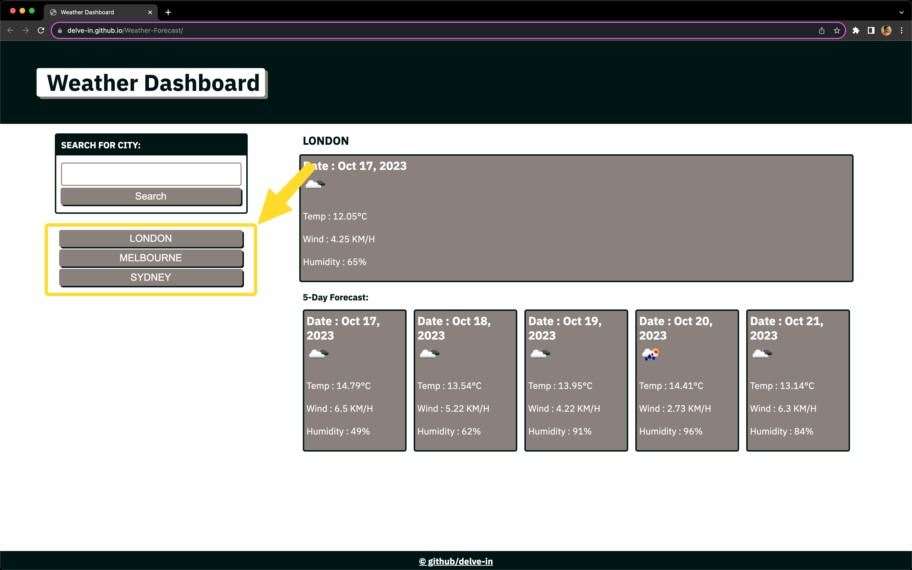

# Weather-Forecast

## Description

This webpage serves as a Weather Dashboard for checking the current weather conditions in a city and the next 5 days forecast.

## Installation

N/A

## Usage

When you first load the page you can see a header with Weather Dashboard written and a search box under the title "SEARCH FOR CITY" with a search button.

You can type in any valid city name and hit search, Which will bring up the current day weather conditions on top and 5 day forecast below with a "5 Day Forecast" subheading.

While you are presented with the forecast the searched city name will be saved below the search button, Which is persistant and will be available wehnever you load the page again. You can click on these saved searches and it will automatically search the city and show the latest conditions.

 At the same time the city name will be pushed up to the top of the list of saved searches which makes it easier for you to find the latest search. If you search a city name that is already present in your saved searches it won't duplicate the city name rather just push the name to the top of the list.

## Credits

N/A

## License

MIT License

## Deployed applicatin link

https://delve-in.github.io/Weather-Forecast/
